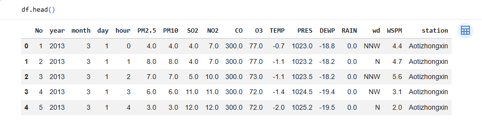
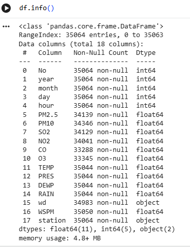
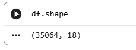

# Data-Analytics-Week-2--Activity-1-Beijing-Multi-Site-Air-Quality
Beijing Multi-Site Air Quality
# Beijing Multi-Site Air Quality Data Analysis (Task-1)

## Dataset
This project uses the Beijing Multi-Site Air Quality dataset from UCI.

## Task-1 Objectives
- Load the dataset
- Display the first 5 rows
- Identify column names and data types
- Count total rows and columns

## Steps Performed

### 1. Load Dataset
The dataset was loaded into a pandas DataFrame.

### 2. Display First 5 Rows
Used df.head() to preview the data.

### 3. Column Names and Data Types
Used df.info() to inspect data types and structure.

### 4. Dataset Size
Used df.shape to identify total rows and columns.

## Results (Screenshots)

## Conclusion
The dataset contains multiple air quality indicators recorded across different monitoring stations in Beijing. The data structure includes both numerical and categorical features.
